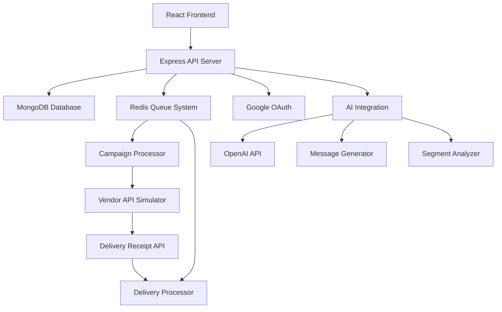

# Mini CRM Platform 🚀

A comprehensive customer relationship management platform with intelligent segmentation, personalized campaign delivery, and AI-powered insights.

## 🌟 Features

### ✅ Core Functionality
- **Secure Data Ingestion APIs** with async processing using Redis queues
- **Dynamic Campaign Builder** with flexible rule-based segmentation
- **Real-time Campaign Delivery** with 90% success simulation
- **Google OAuth 2.0 Authentication** 
- **Comprehensive Analytics Dashboard**

### 🧠 AI-Powered Features
- **Natural Language to Segment Rules** - Convert plain English to logical rules
- **AI Message Suggestions** - Context-aware campaign message generation
- **Performance Summarization** - Human-readable campaign insights
- **Smart Scheduling** - Optimal timing recommendations
- **Lookalike Audience Generator** - Find similar customer segments
- **Auto-campaign Tagging** - Intelligent campaign categorization

### 🏗️ Architecture Highlights
- **Pub-Sub Architecture** with Redis Streams for scalable message processing
- **Batch Processing** for high-volume data operations
- **Real-time Analytics** with MongoDB aggregation pipelines
- **Queue-based Campaign Delivery** with delivery receipt tracking
- **Responsive React UI** with modern design patterns

## 🛠️ Tech Stack

**Frontend:**
- React.js 18 with Hooks
- Tailwind CSS for styling
- Lucide React for icons
- Axios for API communication

**Backend:**
- Node.js with Express.js
- MongoDB with Mongoose ODM
- Redis with Bull Queue for job processing
- Passport.js for Google OAuth
- Postman for API documentation

**Infrastructure:**
- Docker & Docker Compose
- Nginx for production deployment
- Bull Board for queue monitoring

## 🚀 Quick Start

### Prerequisites
- Node.js 18+
- MongoDB 7.0+
- Redis 7.2+
- Google OAuth credentials

### 1. Clone the Repository
```bash
git clone <repository-url>
cd mini-crm-platform
```

### 2. Environment Setup
```bash
# Copy environment file
cp .env.example .env

# Update .env with your credentials:
GOOGLE_CLIENT_ID=your_google_client_id
GOOGLE_CLIENT_SECRET=your_google_client_secret
SESSION_SECRET=your_super_secret_key
MONGODB_URI=mongodb://localhost:27017/minicrm
REDIS_URL=redis://localhost:6379
```

### 3. Installation & Setup

#### Using Docker (Recommended)
```bash
# Start all services
docker-compose up -d

# View logs
docker-compose logs -f
```

#### Manual Installation
```bash
# Install backend dependencies
cd backend
npm install

# Install frontend dependencies
cd ../frontend
npm install

# Start MongoDB and Redis
mongod --dbpath /path/to/data
redis-server

# Start backend (from backend directory)
npm run dev

# Start frontend (from frontend directory)
npm start
```

### 4. Access the Application
- **Frontend**: http://localhost:3000
- **Backend API**: http://localhost:5000
- **Queue Monitor**: http://localhost:3001

## 📚 API Documentation

### Authentication
```bash
# Google OAuth login
GET /auth/google

# Check current user
GET /auth/user

# Logout
POST /auth/logout
```

### Data Ingestion
```bash
# Ingest single customer
POST /api/customers
Content-Type: application/json

{
  "id": "cust_001",
  "name": "John Doe", 
  "email": "john@example.com",
  "totalSpends": 15000,
  "visits": 5,
  "lastVisit": "2024-01-15T10:30:00.000Z"
}

# Batch ingest customers
POST /api/customers/batch
{
  "customers": [...]
}

# Ingest order data
POST /api/orders
{
  "id": "order_001",
  "customerId": "cust_001", 
  "amount": 2500,
  "items": ["Product A", "Product B"]
}
```

### Campaign Management
```bash
# Preview audience size
GET /api/customers/preview?rules={"operator":"AND","conditions":[...]}

# Create campaign
POST /api/campaigns
{
  "name": "High Value Customer Campaign",
  "segmentRules": {
    "operator": "AND",
    "conditions": [
      {"field": "totalSpends", "operator": ">", "value": "10000"}
    ]
  },
  "message": "Hi {name}, here's 20% off your next order!"
}

# Get all campaigns
GET /api/campaigns

# Real-time campaign monitoring
GET /api/campaigns/{id}/realtime
```

### AI Features
```bash
# Convert text to segment rules
POST /api/ai/segment-from-text
{
  "description": "People who haven't shopped in 90 days and spent over ₹10,000"
}

# Get message suggestions  
POST /api/ai/message-suggestions
{
  "objective": "bring back inactive users",
  "audienceSize": 1250
}

# Generate performance summary
POST /api/ai/campaign-performance-summary
{
  "campaignId": "campaign_id"
}

# Get lookalike audiences
POST /api/ai/lookalike-audience
{
  "baseSegmentId": "segment_id" 
}

# Optimal timing suggestions
POST /api/ai/optimal-timing
{
  "audienceRules": {...}
}
```

## 🎯 Usage Examples

### 1. Basic Customer Segmentation
```javascript
// Segment: High-value frequent customers
const segmentRules = {
  operator: 'AND',
  conditions: [
    { field: 'totalSpends', operator: '>', value: '10000' },
    { field: 'visits', operator: '>=', value: '5' }
  ]
};
```

### 2. AI-Powered Campaign Creation
```javascript
// Natural language to rules conversion
const description = "Customers who spent over ₹5000 but haven't visited in 30 days";
const aiRules = await convertTextToRules(description);

// Generate contextual messages
const messages = await getMessageSuggestions("win-back campaign", 850);
```

### 3. Real-time Campaign Monitoring
```javascript
// Monitor campaign progress
const stats = await getCampaignRealTimeStats(campaignId);
console.log(`Delivery rate: ${stats.deliveryRate}%`);
console.log(`Messages sent: ${stats.sent}, failed: ${stats.failed}`);
```

## 🏗️ System Architecture



### Key Components

**Frontend (React)**
- Dashboard with real-time stats
- Dynamic rule builder with drag-drop
- AI-powered segment creation
- Campaign management interface

**Backend (Node.js)**
- RESTful API with Swagger docs
- Async queue processing with Bull
- Real-time campaign monitoring
- Batch data processing

**Data Layer**
- MongoDB for persistent storage
- Redis for queue management
- Optimized queries with aggregation

**AI Integration**
- Text-to-rule conversion
- Contextual message generation
- Performance summarization
- Audience analysis

## 🔧 Configuration

### Environment Variables
```bash
# Database
MONGODB_URI=mongodb://localhost:27017/minicrm
REDIS_URL=redis://localhost:6379

# Authentication  
GOOGLE_CLIENT_ID=your_google_client_id
GOOGLE_CLIENT_SECRET=your_google_client_secret
SESSION_SECRET=your_session_secret

# AI Services (Optional)
OPENAI_API_KEY=your_openai_key
```

### Google OAuth Setup
1. Go to [Google Cloud Console](https://console.cloud.google.com)
2. Create new project or select existing
3. Enable Google+ API
4. Create OAuth 2.0 credentials
5. Add authorized redirect URI: `http://localhost:5000/auth/google/callback`

## 📊 Performance & Scalability

### Queue Processing
- **Async Data Ingestion**: 1000+ records/minute
- **Batch Processing**: Up to 100 records per batch
- **Campaign Delivery**: 600 messages/minute with 90% success rate
- **Delivery Receipt Processing**: Batched updates every 5 seconds

### Database Optimization
- **Indexed Fields**: customer ID, email, totalSpends, visits
- **Aggregation Pipelines**: Real-time analytics
- **Bulk Operations**: Efficient batch inserts/updates

### Monitoring
- Bull Board for queue visualization
- Real-time campaign progress tracking
- Delivery rate analytics
- Performance metrics dashboard

## 🧪 Testing

### API Testing with Postman
```bash
# Import the provided Postman collection
# Test data ingestion endpoints
# Verify campaign creation and delivery
# Check AI feature responses
```

### Sample Test Data
```javascript
// Test customers
const testCustomers = [
  {
    id: 'cust_001',
    name: 'John Doe',
    email: 'john@example.com', 
    totalSpends: 15000,
    visits: 8,
    lastVisit: new Date('2024-01-15')
  },
  // ... more test data
];

// Test campaign
const testCampaign = {
  name: 'High Value Appreciation',
  segmentRules: {
    operator: 'AND',
    conditions: [
      { field: 'totalSpends', operator: '>', value: '10000' }
    ]
  },
  message: 'Hi {name}, enjoy 20% off as our valued customer!'
};
```

## 🚀 Deployment

### Production Environment
```bash
# Build frontend
cd frontend && npm run build

# Start production server
cd backend && NODE_ENV=production npm start

# Or use Docker
docker-compose -f docker-compose.prod.yml up -d
```

### Environment-specific Configs
- **Development**: Hot reload, detailed logging
- **Production**: Optimized builds, security headers
- **Staging**: Production-like with test data

## 🔒 Security Features

- **Google OAuth 2.0** authentication
- **Session-based** user management
- **CORS protection** for API endpoints  
- **Input validation** for all API requests
- **Environment variable** protection for secrets
- **Rate limiting** on sensitive endpoints

## 🤖 AI Integration Details

### Natural Language Processing
```javascript
// Example: "customers who spent over 5000 but haven't visited in 30 days"
// Converts to:
{
  operator: 'AND',
  conditions: [
    { field: 'totalSpends', operator: '>', value: '5000' },
    { field: 'lastVisit', operator: 'inactive_days', value: '30' }
  ]
}
```

### Message Generation
- **Context-aware**: Based on campaign objective
- **Personalized**: Uses customer data placeholders
- **A/B Testing Ready**: Multiple message variants
- **Tone Adaptation**: Formal/casual based on audience

### Performance Analytics
- **Delivery Rate Analysis**: Success/failure patterns
- **Audience Insights**: Segment performance comparison  
- **Timing Optimization**: Best send times by audience type
- **Predictive Metrics**: Estimated completion times

## 🛣️ Roadmap

### Phase 2 Enhancements
- [ ] **Advanced A/B Testing** - Split test campaigns
- [ ] **Email Template Builder** - Visual template editor
- [ ] **SMS/WhatsApp Integration** - Multi-channel delivery
- [ ] **Advanced Analytics** - Conversion tracking, ROI analysis
- [ ] **ML-Powered Predictions** - Customer lifetime value, churn prediction

### Phase 3 Features  
- [ ] **Real-time Personalization** - Dynamic content based on behavior
- [ ] **Automated Workflows** - Trigger-based campaign sequences
- [ ] **Integration APIs** - CRM, E-commerce platform connectors
- [ ] **White-label Solution** - Multi-tenant architecture

## 🤝 Contributing

1. Fork the repository
2. Create feature branch (`git checkout -b feature/amazing-feature`)
3. Commit changes (`git commit -m 'Add amazing feature'`)
4. Push to branch (`git push origin feature/amazing-feature`) 
5. Open Pull Request

## 📄 License

This project is licensed under the MIT License - see the [LICENSE](LICENSE) file for details.

## 📞 Support

For questions and support:
- Create an issue in the repository
- Review the Postman collection for examples

---

**Built with ❤️ using modern web technologies and AI integration**
